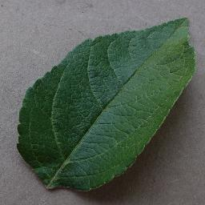

# leaf-image-segmentation

Based on [Automatic Leaf Extraction from Outdoor
Images ](https://arxiv.org/pdf/1709.06437.pdf)

Steps Finished 
1. Background marker generation


Note : currently we can generate marker for plant leaf image 

Use the following command to segment image
```
usage: generate_marker [-h] [-c] [-f {no,flood,threshold,morph}] [-s]
                       [-d DESTINATION]
                       image_source

positional arguments:
  image_source          A path of image filename or folder containing images

optional arguments:
  -h, --help            show this help message and exit
  -c, --contrast        Output image will be as black background and white
                        foreground
  -f {no,flood,threshold,morph}, --fill {no,flood,threshold,morph}
                        Change hole filling technique for holes appearing in
                        segmented output
  -s, --smooth          Output image with smooth edges
  -d DESTINATION, --destination DESTINATION
                        Destination directory for output image. If not
                        specified destination directory will be input image
                        directory
```

#### Example:

__Command used__: `python3 generate_marker.py 'some file or folder'`

__Input Image__
        


__Output Image__


